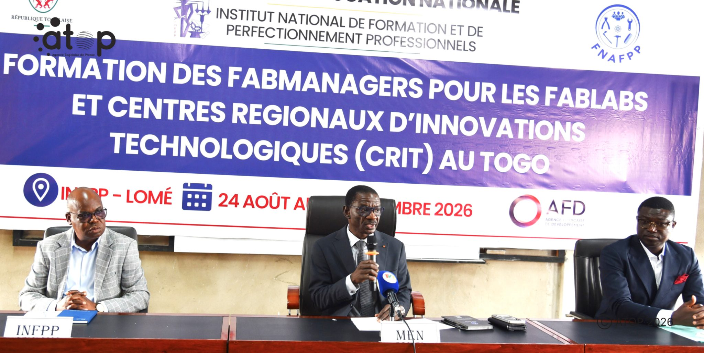
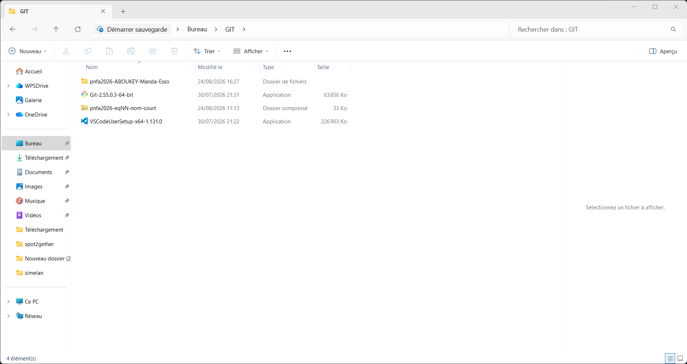
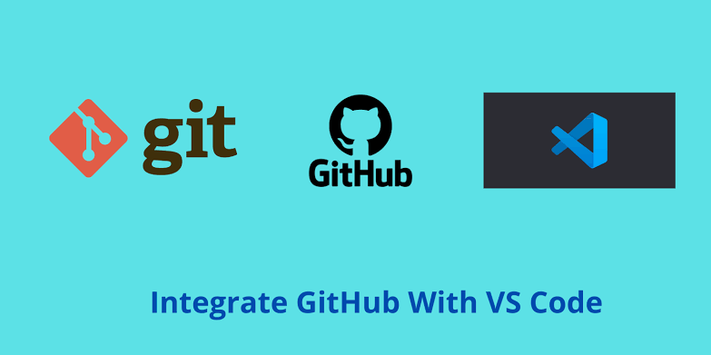

# Journal du 24 Août 2026 (Rédigé par : Manda-Esso ABOUKEY )

## Fait aujourd'hui

- De 8h à 9h : Discours de lancement par le Ministre de l'Education nationnale du
 **MEN, Le Directeur du FNAPP, Le Direceur du IFNPP** 

 

- Présentation des Formateurs et Des Fabmanagers

- Début de Formation avec : [Instalation des package telque: **Git, VScode , Extraction et utilisation d'un fichier ziper pour la documentation** ] 

- Cours sur la Documentation des Projets et sur l'utilisation de 
**Git et Github et De Vscode** 

## Appris

- Comment Codé un mackdown et Connaître les Syntaxe ésentiel pour le faire 
- Comment Executer un marckdown sur vscode ( **lire le code du marckdown**)

## Raté, puis corrigé

- Rien pour le moment tout a bien marché avec les indications des formateurs 

## Décidé

- Redoubler d'éfort car les Choses complexe commence demain 

## À faire demain

- Suite de formation avec Git et Github Création des dépôt et  Envoie des Documentations 