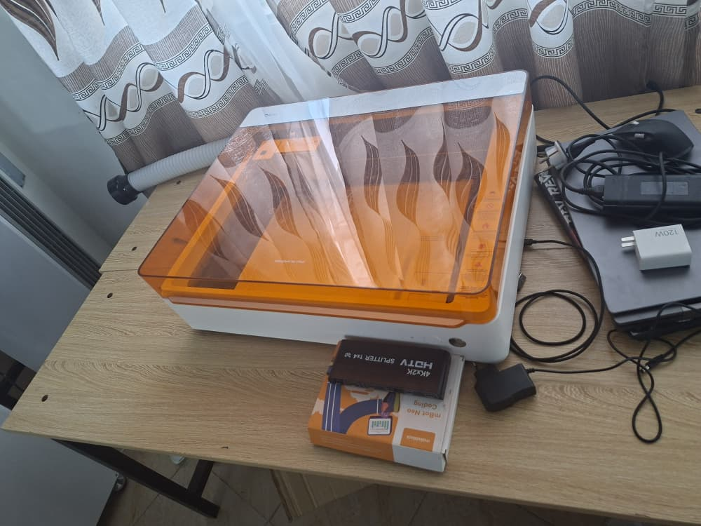
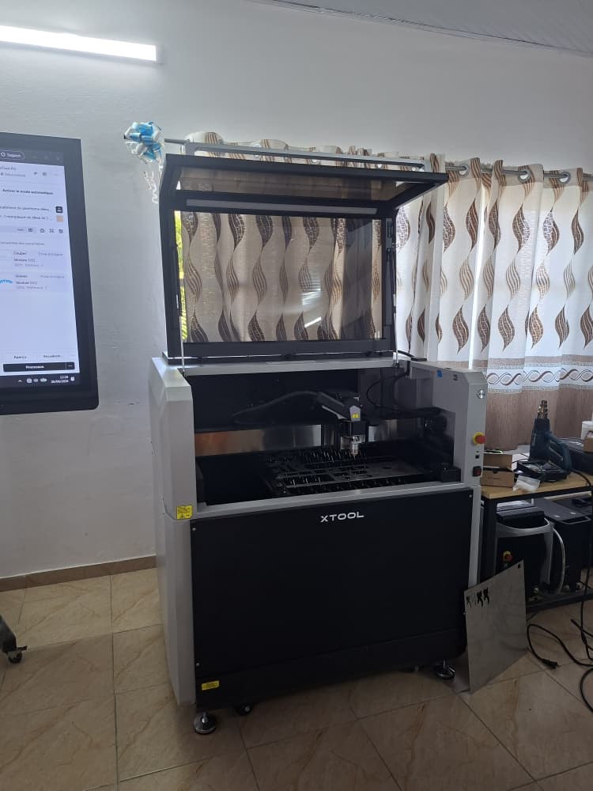
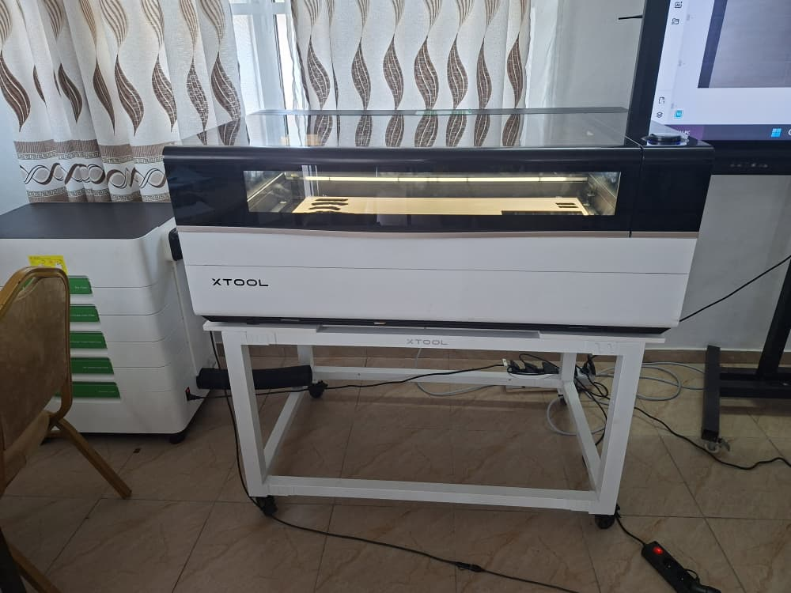
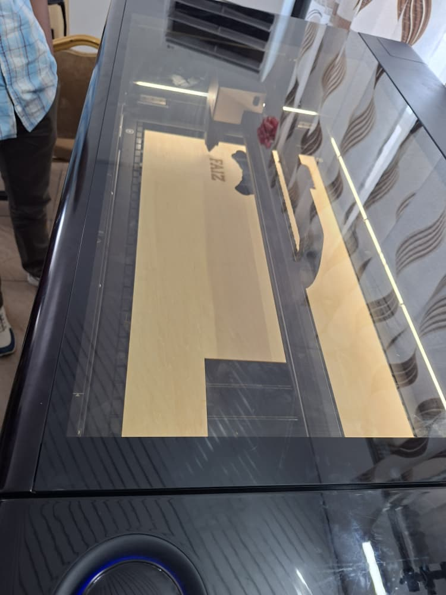
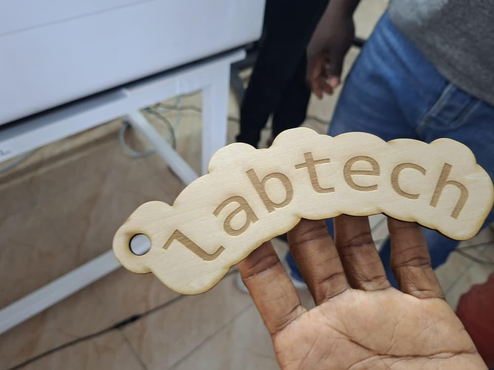
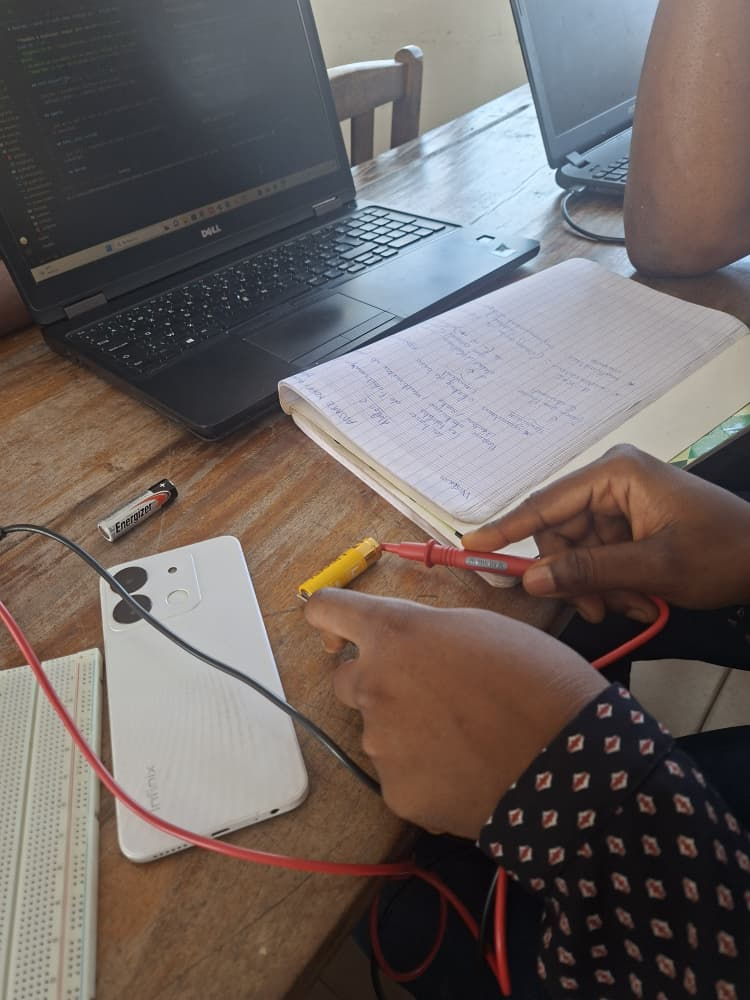

# Journal — mardi 26 août 2026 (rédigé par : Manda-Esso ABOUKEY)

## Fait aujourd'hui

Notion sur les différents Atélier à faire aujourd'hui

### **Aetlier 1** : Projet et notion

- Générlités sur les projets à faire 
- Notion sur les différents ateliers qu'on fera pendant le parcours 

---
### **Atelier 2** : Découpe Laser 

- Fondamentaux  de la technologie Laser
- Marque xtool 
- On va plus utiliser 4 machine  qui sont les machone a laser de type **fibre, co2, uv, diode**
(F2 ultra, Métal lab )
- Appris les Mésures de séccurités pour manipuler les Machines sans accidents
- Instalaton du logiciel **Xtool** pour le designe et la conception 2D des découpage aàfaire 

- Images :

|Machine|Matériaux|Images| image2 | image3|
|---|---|---|---|---|
| Xtool F2 Ultra  |  Fibre|  | Peut aussi Permettre de faire la soudure grace à sa puissance| |
| Xtool M2 | | | | |
|Xtool MetalFab|Fibre||||
|Xtool P3|Co2||||

---
### **Atelier 3** : Les Bases de l'électronique

- Révisions des Bases de l'**électronique** Tels que :
  - Les Grandeurs électrique de base [ Tension, Courant, Resistance  ] 
   et leurs unité de mésure et leurs formule 

- Présentations du multimètre et sont Fonctionnement 
 et Teste de mésure des différente grandeurs  
   - Mésure des valeurs d'une résistance en fonction de ses couleur 
   - Mésure de la tenssion de 2 pile Diférente dont :
     - La **pile Noir** qui était en **Fin de vie** car sa tenssion est inférieur a celle marqué sur elle
     - La pile jaune qui était a peu prêt en débbut car elle était presque pareil que son étiquete
     

---
### **Atelier 4** : Fabrication Additive

- Présentation et Généralité du Module d'impression 3D
- Présentation des différentes Machine d'impression
- Présentation des type de fil à Utiliser pour faire l'impression 3D

---

## Appris
 **Découpe laser**
- comment démarrer une machine de découpe laser
- comment lier, faire les cadrage avec le logiciel , comment desiner ce que on veut découper , Comment Faire Les réglages Nécéssaire Pour abourtir à un résultat
- Ce que peut faire un découpe Laser ( Graver et Découper)
- Prendre les Différente types de Mésure avec un multimètre en fesant les bon cadrage du Cadrant 

## Raté, puis corrigé

Rien de raté pour le moment  je renseignerez une fois que je serai sur  les machines et que je ferai des erreurs

## Décidé

- Suivre Une formation complémentaire en ligne pour me prmettre d'avancer et de Mieux assimlier ce que nos frmateurs nous enseigne

## À faire demain

- Modéliser mon Nom et l'imprimer 
- Continuer avec la Pratique de la Formation et posé beaucoup de question Pr accomplir ma mission
