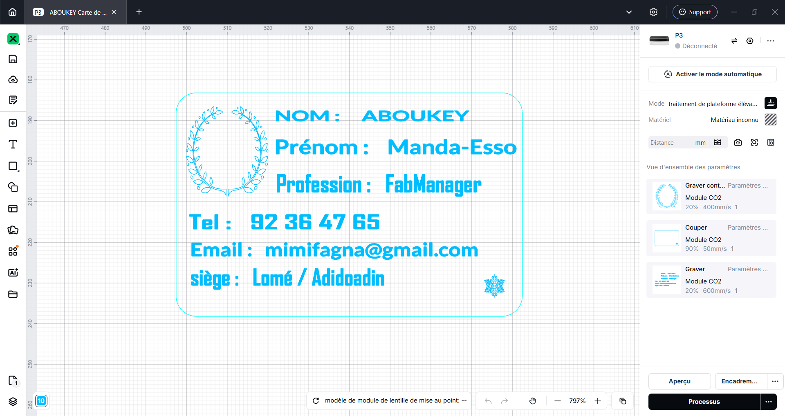
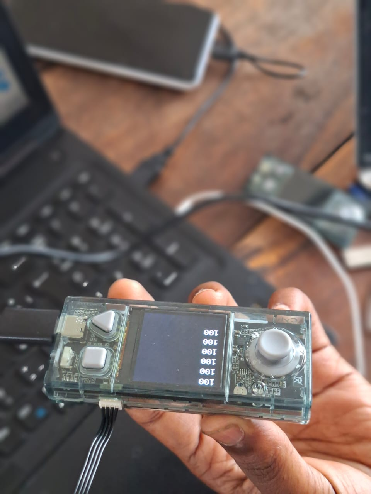
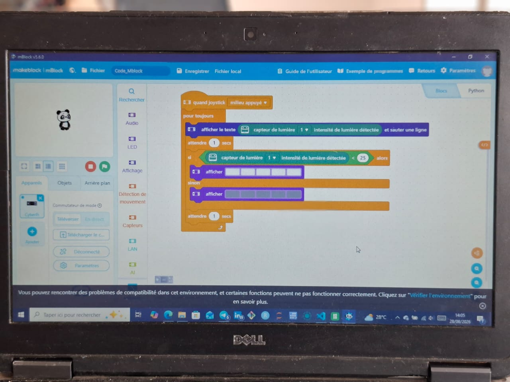

# Journal — mardi 27 août 2026 (rédigé par : Manda-Esso ABOUKEY)

## Fait aujourd'hui

Notion sur les différents Atélier à faire aujourd'hui

### **Aetlier 1** : Modélisaation et Impression

- Rapels des Notions de la veille
- Instalation des logiciel de Modélisation(slicr)

    - **Logiciel intalé** : Bambu studio , Pursaslicer et Fusion
- Utilisaation d'un fichier d'un objt Modéliser : **Un CUBE** 
[Projt-1/Cube016Profile.stl](d:/Projt-1/Cube016Profile.stl) 

- On a vu Comment parametrer ce fichier pour l'impression 3D 

Le diamère du buse dans le logiciel est de 0,4 mm par défaut . Ce qui peut être modifier en fonction du diamètre de l'imprimante que on veut utiliser
  
- On a parlé des **Parètres clés : 
Qui sont La Température et le Remplisage**

     **Température**

         Les fillaments utilisés doivent être chauffé . donc en fonction de la rapidité a la quelle on veut que le file fonde et coule on ajuste.

- La plus part des filaments nécécite une plauqe chauffante pour la stabilisation saul le PLA.

    **Replissage**

   - Les motifs de remplisage :  ligne droite,grid, gyroid, Honeycomb...
---
### **Atelier 2** : Découpe Laser

- Modélisation des carte de visites pour imprimé en 2D
- Ona vu les différents paramètres de réglages a faire qd on veut modéliser nos projets , on a vus les différent outils présent dans le xtool pour y arriver 
- En fin on a découpé et gravé nos cartes de visite avec  Contreplaqé dans le xtool P3

|Machine|Matériaux|Modélisation| Résultat||
|---|---|---|---|---|
|Xtool P3|Contreplaqué|||

---
### **Atelier 3** : Cyberpi et Ecosystème Mbuild

- Présentation et environement du Programme :
   -  On a vu un **cyberpi** qui est un mini pour la Programation, L'IA et L'IOT(Internet des Objets)

**image** : 

   On a donc vu comment il fonctionnait .
   Coment le liér a l'ordinateur pour qu'il puisse Exécutr le (Program) , ses différente composante : les entrées et sorties , ses boutons etc...

- Instalation du Logiciel mBlockqui nous permet d'écrire Les Problème par Blocs Pour ajencés les blocs de code déja existant et dire au cyberpi ce qu'il doit faire:

    - Donc en Gros on a vus les Paramètres et comment l'ajencer, faire télecharger le code au  **cyberpi** pour qu'il l'exécute : 
 ; 

---

## Appris
- comment Faire du G-code
- C'est quoi un cyberpi et comment il fonctionne 
Comment marche les logiciel d'imprimante 2D et 3D pour aboutir a son projets 

## Raté, puis corrigé

Lors de l'xercice en Atelier de l'ELECTRONIQUE on nous dit d'écrire un programe pour faire affiché j'ai raté le début car je voulais faire un truc trop Compliqué 
- J'ai finis par aler simplementet j'ai pus faire marché les leds

## Décidé

-  Suivre les instructions et en voulant faire La pratique aller le pus simplement possible Pour y arriver 

## À faire demain

- Continuer la pratique en découpe laser, En electronique et en Impression 3D