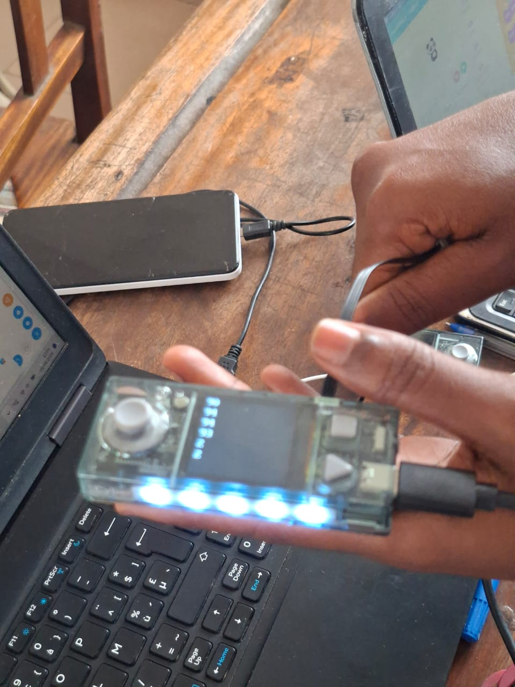
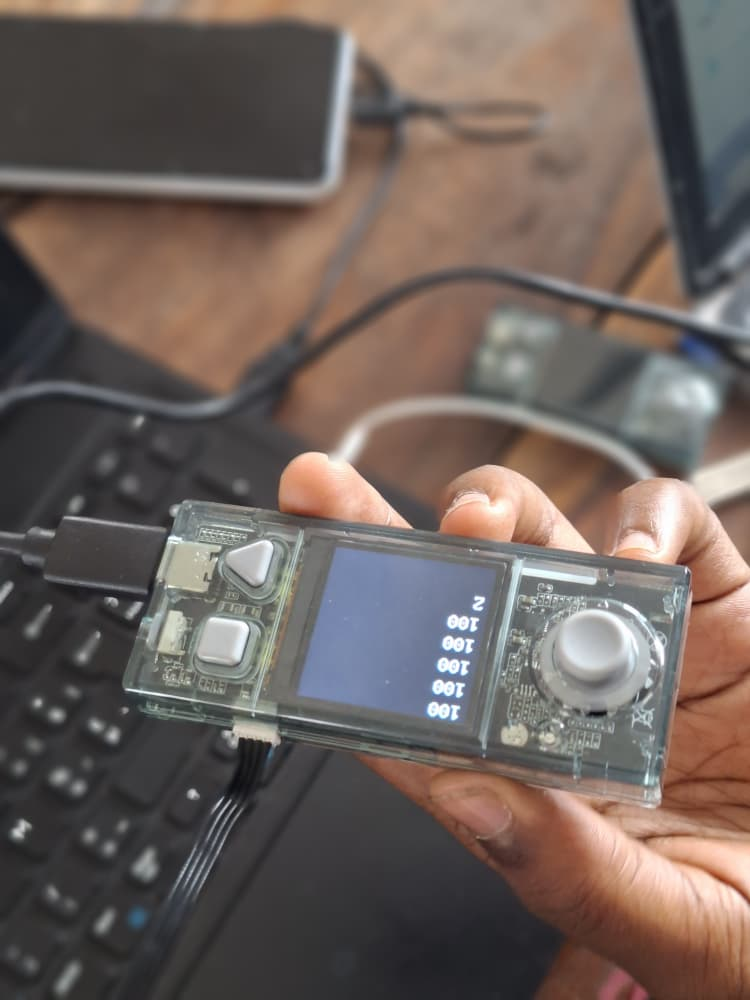
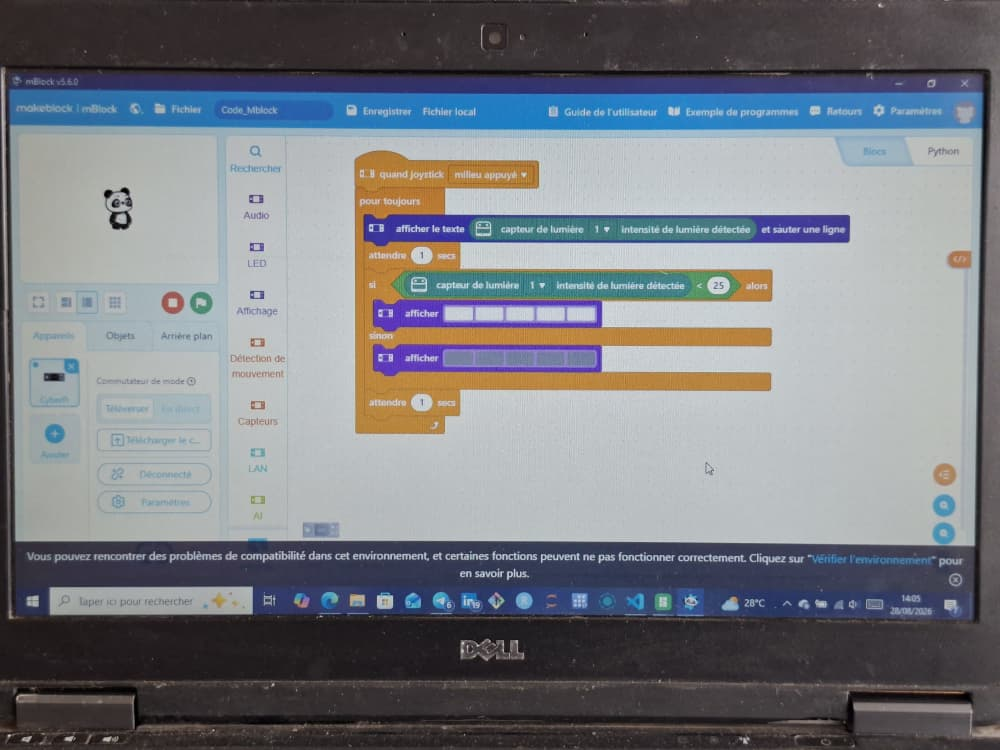

# Journal — mardi 28 août 2026 (rédigé par : Manda-Esso ABOUKEY)

## Fait aujourd'hui

Suite des atteliers 
- En Electronique ecrire un autre code qui permet d'allumer et d'éteindre la lumière en fonction de la lumière . c'est a dire i il fait nuit ou pas  
- Pour cela on a utilisé un capteur de lumière et ecris du code a télécharger au cyberpi
 
 Images de l'attelier :

|Outils|Résultat en image|image2| ||
|---|---|---|---|---|
|Cyberpi||||
|Capteur de lumière||||
|Code du mBlock||||

---

## Appris
- J'ai mieux Compris comment s'utilisait le G-Code pour donner des instruction au cyberpi
- J'ai aussi vu comment fonctionne un capteur de lumière et comment l'utiliser

## Raté, puis corrigé

- Rien de Mal Fait Pour le Moment On continue demain

## Décidé

- Continuer d'écouter et pratiquer

## À faire demain

